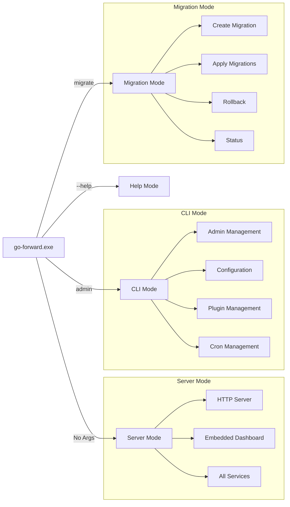

# Design Document

## Overview

The Unified Go Forward Framework is a comprehensive, production-ready backend framework that combines core BaaS capabilities with enterprise-grade security and administrative controls. The system is designed as a single executable that contains the server, admin CLI, and migration tools, providing a complete solution for both hosted BaaS deployments and custom development projects.

The framework implements a security-first architecture with a hierarchical admin system, comprehensive audit logging, and advanced security policies. It features an embedded SvelteKit admin dashboard with role-based interfaces, auto-generated APIs with field-level permissions, real-time capabilities, and extensive customization options.

Key architectural principles:
- **Single Executable Architecture**: Server, CLI, and migration tools in one binary
- **Security-First Design**: Multi-tiered admin hierarchy with comprehensive audit logging
- **Agile Development**: Each feature is fully functional upon completion
- **Embedded Dashboard**: SvelteKit admin interface built alongside each feature
- **Dynamic Configuration**: Automatic reflection of new configuration options
- **Comprehensive Documentation**: Auto-generated Swagger docs and feature documentation

## Architecture

### High-Level System Architecture

```mermaid
graph TB
    CLI[CLI Interface] --> Core[Core Framework]
    WebUI[Web Interface] --> Gateway[Security Gateway]
    
    Gateway --> AuthCore[Authentication Core]
    Gateway --> AdminSec[Admin Security]
    Gateway --> APIGen[API Generator]
    Gateway --> Realtime[Realtime Engine]
    Gateway --> Storage[Storage Service]
    Gateway --> Dashboard[Embedded Dashboard]
    
    subgraph "Security Layer"
        AuthCore --> MFA[MFA Service]
        AuthCore --> Session[Session Manager]
        AdminSec --> RBAC[RBAC Engine]
        AdminSec --> Audit[Audit System]
        AdminSec --> Policy[Policy Engine]
    end
    
    subgraph "Data Layer"
        Core --> DB[(PostgreSQL)]
        Core --> Redis[(Redis Cache)]
        Storage --> FS[File System/S3]
        Audit --> AuditDB[(Audit Logs)]
    end
    
    subgraph "Communication"
        AuthCore --> Email[Email Service]
        AuthCore --> SMS[SMS Service - Arkesel]
        Email --> Templates[Email Templates]
        SMS --> SMSTemplates[SMS Templates]
    end
    
    subgraph "Admin Dashboard (/_/)"
        Dashboard --> UserMgmt[User Management]
        Dashboard --> TableConfig[Table Configuration]
        Dashboard --> SecurityConfig[Security Configuration]
        Dashboard --> AuditViewer[Audit Viewer]
        Dashboard --> SQLEditor[SQL Editor]
        Dashboard --> MigrationUI[Migration UI]
        Dashboard --> PluginMgmt[Plugin Management]
        Dashboard --> CronMgmt[Cron Management]
        Dashboard --> DocViewer[Documentation Viewer]
    end
```##
# Admin Hierarchy and Security Architecture

```mermaid
graph TD
    SystemAdmin[System Admin] --> |Full Control| SystemLevel[System Level Operations]
    SystemAdmin --> |Full Control| BusinessLevel[Business Level Operations]
    
    SuperAdmin[Super Admin] --> |Limited Control| BusinessLevel
    SuperAdmin --> |No Access| SystemLevel
    
    RegularAdmin[Regular Admin] --> |Scoped Access| AssignedResources[Assigned Resources]
    
    Moderator[Moderator] --> |Read Only| Reports[Reports & Analytics]
    Moderator --> |Limited| ContentMod[Content Moderation]
    
    subgraph "System Level (System Admin Only)"
        SystemLevel --> SQLExecution[SQL Execution]
        SystemLevel --> SystemConfig[System Configuration]
        SystemLevel --> AdminMgmt[Admin Management]
        SystemLevel --> SecurityPolicies[Security Policies]
        SystemLevel --> PluginInstall[Plugin Installation]
    end
    
    subgraph "Business Level (Super Admin+)"
        BusinessLevel --> TableMgmt[Table Management]
        BusinessLevel --> UserAdmin[User Administration]
        BusinessLevel --> StorageMgmt[Storage Management]
        BusinessLevel --> AuditAccess[Audit Access]
        BusinessLevel --> ConfigMgmt[Configuration Management]
    end
    
    subgraph "Scoped Access (Regular Admin)"
        AssignedResources --> AssignedTables[Assigned Tables]
        AssignedResources --> UserGroups[User Groups]
        AssignedResources --> LimitedConfig[Limited Configuration]
    end
```

### Single Executable Architecture



## Components and Interfaces

### 1. Unified Authentication Core Component

**Technology**: Go with enhanced JWT management, MFA support, and template system
**Responsibilities**:
- Multi-method authentication (OTP, credentials, custom providers)
- Admin hierarchy management and enforcement
- Multi-factor authentication (TOTP, backup codes)
- HTTP-only cookie and bearer token support
- Customizable email and SMS templates
- Security event detection and response

**Key Interfaces**:
```go
type UnifiedAuthService interface {
    // Standard authentication
    Register(ctx context.Context, req *RegisterRequest) (*AuthResponse, error)
    Login(ctx context.Context, req *LoginRequest) (*AuthResponse, error)
    LoginWithCookies(ctx context.Context, req *LoginRequest) (*AuthResponse, *http.Cookie, *http.Cookie, error)
    RefreshToken(ctx context.Context, token string) (*AuthResponse, error)
    
    // OTP authentication with templates
    SendOTP(ctx context.Context, req *OTPRequest) error
    VerifyOTP(ctx context.Context, req *VerifyOTPRequest) (*AuthResponse, error)
    
    // Admin authentication
    AuthenticateAdmin(ctx context.Context, req *AdminAuthRequest) (*AdminAuthResponse, error)
    CreateSystemAdmin(ctx context.Context, req *CreateSystemAdminRequest) (*SystemAdmin, error)
    PromoteToAdmin(ctx context.Context, userID string, level AdminLevel, promotedBy string) error
    
    // MFA management
    EnableMFA(ctx context.Context, userID string, method MFAMethod) (*MFASetup, error)
    VerifyMFA(ctx context.Context, userID string, code string) error
    
    // Session management
    CreateAdminSession(ctx context.Context, userID string, capabilities AdminCapabilities) (*AdminSession, error)
    ValidateSession(ctx context.Context, sessionID string) (*AdminSession, error)
    
    // Template management
    GetTemplate(ctx context.Context, templateType TemplateType, purpose string) (*Template, error)
    UpdateTemplate(ctx context.Context, template *Template) error
    PreviewTemplate(ctx context.Context, template *Template, variables map[string]interface{}) (string, error)
}

type TemplateService interface {
    CreateTemplate(template *Template) error
    UpdateTemplate(templateID string, updates *TemplateUpdates) error
    GetTemplate(templateType TemplateType, purpose string, language string) (*Template, error)
    ValidateTemplate(template *Template) error
    RenderTemplate(template *Template, variables map[string]interface{}) (string, error)
    GetAvailableVariables(purpose string) []TemplateVariable
}

type CommunicationService interface {
    SendEmail(ctx context.Context, req *EmailRequest) error
    SendSMS(ctx context.Context, req *SMSRequest) error
    SendOTPEmail(ctx context.Context, recipient, code, purpose string) error
    SendOTPSMS(ctx context.Context, recipient, code, purpose string) error
    ConfigureProvider(providerType ProviderType, config ProviderConfig) error
}
```### 2.
 Enhanced Database Meta Service with Relationships

**Technology**: Go with PostgreSQL introspection and relationship management
**Responsibilities**:
- Database schema introspection and management
- Foreign key relationship support with cascade options
- Rich text and file field integration
- Migration tracking for admin panel operations
- Advanced query capabilities with preloading
- Security policy integration

**Key Interfaces**:
```go
type EnhancedMetaService interface {
    // Table management
    GetTables(ctx context.Context, schema string) ([]*Table, error)
    CreateTable(ctx context.Context, table *TableDefinition) error
    UpdateTable(ctx context.Context, tableName string, changes *TableChanges) error
    DeleteTable(ctx context.Context, tableName string) error
    
    // Relationship management
    CreateRelationship(ctx context.Context, rel *Relationship) error
    UpdateRelationship(ctx context.Context, relID string, updates *RelationshipUpdates) error
    DeleteRelationship(ctx context.Context, relID string) error
    GetTableRelationships(ctx context.Context, tableName string) ([]*Relationship, error)
    
    // Advanced field types
    CreateRichTextField(ctx context.Context, tableName, fieldName string, config *RichTextConfig) error
    CreateFileField(ctx context.Context, tableName, fieldName string, config *FileFieldConfig) error
    
    // Migration integration
    GenerateMigrationFromTableOperation(ctx context.Context, operation *TableOperation) (*Migration, error)
    TrackTableCreationMethod(ctx context.Context, tableName string, method CreationMethod) error
    GetTableHistory(ctx context.Context, tableName string) (*TableHistory, error)
    
    // Query capabilities
    ExecuteQueryWithPreload(ctx context.Context, query *Query, preloadConfig *PreloadConfig) (*QueryResult, error)
    OptimizeQuery(ctx context.Context, query *Query) (*OptimizedQuery, error)
}

type RelationshipManager interface {
    ValidateRelationship(rel *Relationship) error
    CreateForeignKey(ctx context.Context, rel *Relationship) error
    DropForeignKey(ctx context.Context, relID string) error
    GetCascadeOptions() []CascadeOption
    ValidateCascadeOperation(ctx context.Context, operation *CascadeOperation) error
}

type FieldTypeManager interface {
    RegisterFieldType(fieldType *CustomFieldType) error
    GetSupportedFieldTypes() []*FieldType
    ValidateFieldConfig(fieldType string, config map[string]interface{}) error
    RenderFieldEditor(fieldType string, config map[string]interface{}) (string, error)
}
```

### 3. Advanced API Generator with Security Integration

**Technology**: Go with dynamic endpoint generation and comprehensive security
**Responsibilities**:
- Auto-generate CRUD endpoints with security middleware
- Field-level permission enforcement
- Custom filter and ownership validation
- Rate limiting and DDoS protection
- Swagger documentation generation
- Real-time API integration

**Key Interfaces**:
```go
type AdvancedAPIService interface {
    // Endpoint generation
    GenerateEndpoints(ctx context.Context, schema *DatabaseSchema) error
    GenerateTableEndpoints(ctx context.Context, table *Table, config *TableSecurityConfig) error
    RegisterCustomEndpoint(path string, handler http.HandlerFunc, security *SecurityConfig) error
    
    // Security integration
    ApplySecurityMiddleware(endpoint *Endpoint, config *SecurityConfig) error
    ValidateFieldPermissions(ctx context.Context, userID string, table string, fields []string, operation Operation) error
    ApplyOwnershipFilter(ctx context.Context, query *Query, userID string, config *OwnershipConfig) (*Query, error)
    
    // Documentation
    GenerateSwaggerDoc(ctx context.Context) (*SwaggerDoc, error)
    UpdateEndpointDoc(endpoint *Endpoint, doc *EndpointDoc) error
    
    // Rate limiting
    ApplyRateLimit(ctx context.Context, userID, endpoint string) error
    ConfigureEndpointRateLimit(endpoint string, config *RateLimitConfig) error
}

type SecurityMiddleware interface {
    AuthenticationMiddleware(config *AuthConfig) gin.HandlerFunc
    AuthorizationMiddleware(config *AuthzConfig) gin.HandlerFunc
    RateLimitMiddleware(config *RateLimitConfig) gin.HandlerFunc
    AuditMiddleware(config *AuditConfig) gin.HandlerFunc
    FieldFilterMiddleware(config *FieldFilterConfig) gin.HandlerFunc
}

type SwaggerGenerator interface {
    GenerateAPIDoc(endpoints []*Endpoint) (*SwaggerDoc, error)
    UpdateEndpointDoc(endpoint *Endpoint, doc *EndpointDoc) error
    AddSecuritySchemes(schemes []*SecurityScheme) error
    ExportSwaggerJSON() ([]byte, error)
    ExportSwaggerYAML() ([]byte, error)
}
```###
 4. Comprehensive Security Gateway

**Technology**: Go with advanced security middleware and monitoring
**Responsibilities**:
- Request authentication and authorization
- Rate limiting and DDoS protection with progressive blocking
- Input validation and sanitization
- Security header injection
- Comprehensive audit logging
- Real-time security monitoring

**Key Interfaces**:
```go
type SecurityGateway interface {
    // Middleware creation
    CreateAuthMiddleware(config *AuthMiddlewareConfig) gin.HandlerFunc
    CreateRateLimitMiddleware(config *RateLimitConfig) gin.HandlerFunc
    CreateAuditMiddleware(config *AuditConfig) gin.HandlerFunc
    CreateSecurityHeadersMiddleware(config *SecurityHeadersConfig) gin.HandlerFunc
    
    // Security enforcement
    ValidateRequest(ctx context.Context, req *http.Request) (*ValidationResult, error)
    EnforceRateLimit(ctx context.Context, key string, limit *RateLimit) error
    CheckIPWhitelist(ip string, context *SecurityContext) (bool, error)
    
    // DDoS protection
    DetectDDoSPattern(ctx context.Context, traffic *TrafficPattern) (bool, error)
    ActivateEmergencyMode(ctx context.Context, reason string) error
    DeactivateEmergencyMode(ctx context.Context) error
}

type InputValidator interface {
    ValidateJSON(data []byte, schema *ValidationSchema) error
    SanitizeInput(input string, rules *SanitizationRules) (string, error)
    ValidateSQL(query string, userRoles []string) error
    CheckForInjection(input string) (bool, []string)
    ValidateFileUpload(file *multipart.FileHeader, rules *FileValidationRules) error
}

type SecurityMonitor interface {
    RecordSecurityEvent(ctx context.Context, event *SecurityEvent) error
    DetectAnomalousActivity(ctx context.Context, userID string) (*SecurityAlert, error)
    TriggerSecurityAlert(ctx context.Context, alert *SecurityAlert) error
    GetSecurityMetrics(ctx context.Context, filter *MetricsFilter) (*SecurityMetrics, error)
}
```

### 5. Embedded SvelteKit Dashboard Service

**Technology**: SvelteKit with TypeScript, Tailwind CSS, and pnpm
**Responsibilities**:
- Serve embedded dashboard from Go binary with `/_/` prefix
- Role-based interface rendering
- Real-time updates and WebSocket integration
- Mobile-responsive design with theme switching
- Comprehensive admin functionality
- Integrated documentation viewer

**Key Interfaces**:
```go
type EmbeddedDashboardService interface {
    // Asset serving
    ServeStaticAssets(path string) http.Handler
    HandleSPARouting() http.Handler
    GetDashboardConfig(ctx context.Context, userID string) (*DashboardConfig, error)
    
    // Role-based rendering
    GetUserInterface(ctx context.Context, userID string) (*UserInterface, error)
    FilterMenuItems(ctx context.Context, items []*MenuItem, userRoles []string) ([]*MenuItem, error)
    
    // Real-time integration
    CreateWebSocketHandler() gin.HandlerFunc
    BroadcastUpdate(ctx context.Context, update *DashboardUpdate) error
    
    // Theme and customization
    GetThemeConfig(ctx context.Context, userID string) (*ThemeConfig, error)
    UpdateThemeConfig(ctx context.Context, userID string, config *ThemeConfig) error
}

type DashboardAPI interface {
    // User management
    GetUsers(ctx context.Context, filter *UserFilter) (*UserListResponse, error)
    CreateUser(ctx context.Context, req *CreateUserRequest) (*UserResponse, error)
    UpdateUser(ctx context.Context, userID string, req *UpdateUserRequest) (*UserResponse, error)
    
    // Table management
    GetTables(ctx context.Context) (*TableListResponse, error)
    CreateTable(ctx context.Context, req *CreateTableRequest) (*TableResponse, error)
    UpdateTableConfig(ctx context.Context, tableName string, config *TableSecurityConfig) error
    
    // Security configuration
    GetSecurityConfig(ctx context.Context) (*SecurityConfigResponse, error)
    UpdateSecurityConfig(ctx context.Context, config *SecurityConfigRequest) error
    
    // Audit and monitoring
    GetAuditLogs(ctx context.Context, filter *AuditFilter) (*AuditLogResponse, error)
    GetSecurityEvents(ctx context.Context, filter *SecurityEventFilter) (*SecurityEventResponse, error)
    ExportAuditLogs(ctx context.Context, filter *AuditFilter, format ExportFormat) ([]byte, error)
}
```### 6.
 Unified CLI Management System

**Technology**: Go with Cobra CLI framework
**Responsibilities**:
- System admin creation and management
- Migration operations with security validation
- Plugin management and installation
- Configuration management
- Cron job management
- Emergency access procedures

**Key Interfaces**:
```go
type UnifiedCLI interface {
    // Admin management
    CreateSystemAdmin(req *CreateSystemAdminRequest) (*SystemAdmin, error)
    PromoteUser(userID string, level AdminLevel, promotedBy string) error
    ListAdmins(filter *AdminFilter) ([]*AdminInfo, error)
    
    // Migration management
    CreateMigration(name string, template MigrationType) (*Migration, error)
    ApplyMigrations(target string) (*MigrationResult, error)
    RollbackMigration(migrationID string) (*MigrationResult, error)
    GetMigrationStatus() (*MigrationStatus, error)
    
    // Plugin management
    InstallPlugin(pluginPath string, config *PluginConfig) (*PluginInfo, error)
    UninstallPlugin(pluginName string) error
    ListPlugins() ([]*PluginInfo, error)
    ConfigurePlugin(pluginName string, config map[string]interface{}) error
    
    // Configuration management
    GetConfig(section string) (map[string]interface{}, error)
    SetConfig(section string, key string, value interface{}) error
    ValidateConfig() (*ConfigValidationResult, error)
    BackupConfig() (string, error)
    RestoreConfig(backupPath string) error
    
    // Cron management
    CreateCronJob(job *CronJob) (*CronJobInfo, error)
    UpdateCronJob(jobID string, updates *CronJobUpdates) (*CronJobInfo, error)
    DeleteCronJob(jobID string) error
    ListCronJobs() ([]*CronJobInfo, error)
    
    // Emergency operations
    CreateEmergencyAccess(reason string, duration time.Duration) (*EmergencyAccess, error)
    RevokeEmergencyAccess(accessID string) error
}

type EnvironmentManager interface {
    DetectEnvironment() (Environment, error)
    ApplyEnvironmentPolicies(env Environment) error
    ValidateProductionRequirements() (*ValidationResult, error)
    GetEnvironmentConfig(env Environment) (*EnvironmentConfig, error)
}
```

## Data Models

### Enhanced Security and Admin Models

```go
// UnifiedUser represents a user with admin capabilities
type UnifiedUser struct {
    ID            string                 `json:"id" db:"id"`
    Email         *string                `json:"email" db:"email"`
    Phone         *string                `json:"phone" db:"phone"`
    Username      *string                `json:"username" db:"username"`
    PasswordHash  string                 `json:"-" db:"password_hash"`
    EmailVerified bool                   `json:"email_verified" db:"email_verified"`
    PhoneVerified bool                   `json:"phone_verified" db:"phone_verified"`
    
    // Admin fields
    AdminLevel    *AdminLevel            `json:"admin_level" db:"admin_level"`
    Capabilities  *AdminCapabilities     `json:"capabilities" db:"capabilities"`
    AssignedTables []string              `json:"assigned_tables" db:"assigned_tables"`
    
    // Security fields
    MFAEnabled    bool                   `json:"mfa_enabled" db:"mfa_enabled"`
    LastLogin     *time.Time             `json:"last_login" db:"last_login"`
    FailedAttempts int                   `json:"failed_attempts" db:"failed_attempts"`
    LockedUntil   *time.Time             `json:"locked_until" db:"locked_until"`
    
    // Standard fields
    Metadata      map[string]interface{} `json:"metadata" db:"metadata"`
    CreatedAt     time.Time              `json:"created_at" db:"created_at"`
    UpdatedAt     time.Time              `json:"updated_at" db:"updated_at"`
    CreatedBy     *string                `json:"created_by" db:"created_by"`
    UpdatedBy     *string                `json:"updated_by" db:"updated_by"`
}

// AdminCapabilities defines comprehensive admin permissions
type AdminCapabilities struct {
    // System-level capabilities (System Admin only)
    CanAccessSQL         bool     `json:"can_access_sql"`
    CanManageDatabase    bool     `json:"can_manage_database"`
    CanManageSystem      bool     `json:"can_manage_system"`
    CanCreateSuperAdmin  bool     `json:"can_create_super_admin"`
    CanInstallPlugins    bool     `json:"can_install_plugins"`
    CanModifySecurityConfig bool  `json:"can_modify_security_config"`
    
    // Super admin capabilities
    CanCreateAdmins      bool     `json:"can_create_admins"`
    CanManageAllTables   bool     `json:"can_manage_all_tables"`
    CanManageAuth        bool     `json:"can_manage_auth"`
    CanManageStorage     bool     `json:"can_manage_storage"`
    CanViewAllLogs       bool     `json:"can_view_all_logs"`
    CanManageTemplates   bool     `json:"can_manage_templates"`
    CanManageCronJobs    bool     `json:"can_manage_cron_jobs"`
    
    // Regular admin capabilities
    CanManageUsers       bool     `json:"can_manage_users"`
    CanManageContent     bool     `json:"can_manage_content"`
    AssignedTables       []string `json:"assigned_tables"`
    AssignedUserGroups   []string `json:"assigned_user_groups"`
    CanExportData        bool     `json:"can_export_data"`
    
    // Moderator capabilities
    CanViewReports       bool     `json:"can_view_reports"`
    CanModerateContent   bool     `json:"can_moderate_content"`
    CanViewBasicLogs     bool     `json:"can_view_basic_logs"`
    
    // Common capabilities
    CanViewDashboard     bool     `json:"can_view_dashboard"`
    CanUpdateProfile     bool     `json:"can_update_profile"`
}
````
``go
// Template represents customizable communication templates
type Template struct {
    ID          string                 `json:"id" db:"id"`
    Type        TemplateType           `json:"type" db:"type"` // email, sms
    Purpose     string                 `json:"purpose" db:"purpose"` // login, registration, verification, password_reset
    Language    string                 `json:"language" db:"language"`
    Subject     *string                `json:"subject" db:"subject"` // For email templates
    Content     string                 `json:"content" db:"content"`
    Variables   []TemplateVariable     `json:"variables" db:"variables"`
    IsDefault   bool                   `json:"is_default" db:"is_default"`
    IsActive    bool                   `json:"is_active" db:"is_active"`
    CreatedBy   string                 `json:"created_by" db:"created_by"`
    CreatedAt   time.Time              `json:"created_at" db:"created_at"`
    UpdatedBy   string                 `json:"updated_by" db:"updated_by"`
    UpdatedAt   time.Time              `json:"updated_at" db:"updated_at"`
}

// TemplateVariable represents available variables for templates
type TemplateVariable struct {
    Name        string `json:"name"`
    Description string `json:"description"`
    Type        string `json:"type"` // string, number, date, boolean
    Required    bool   `json:"required"`
    Example     string `json:"example"`
}

// Relationship represents table relationships with cascade options
type Relationship struct {
    ID              string         `json:"id" db:"id"`
    Name            string         `json:"name" db:"name"`
    FromTable       string         `json:"from_table" db:"from_table"`
    FromColumn      string         `json:"from_column" db:"from_column"`
    ToTable         string         `json:"to_table" db:"to_table"`
    ToColumn        string         `json:"to_column" db:"to_column"`
    RelationType    RelationType   `json:"relation_type" db:"relation_type"` // one_to_one, one_to_many, many_to_many
    CascadeOnUpdate CascadeOption  `json:"cascade_on_update" db:"cascade_on_update"`
    CascadeOnDelete CascadeOption  `json:"cascade_on_delete" db:"cascade_on_delete"`
    IsRequired      bool           `json:"is_required" db:"is_required"`
    CreatedAt       time.Time      `json:"created_at" db:"created_at"`
    UpdatedAt       time.Time      `json:"updated_at" db:"updated_at"`
}

// CronJob represents scheduled tasks
type CronJob struct {
    ID              string                 `json:"id" db:"id"`
    Name            string                 `json:"name" db:"name"`
    Description     string                 `json:"description" db:"description"`
    CronExpression  string                 `json:"cron_expression" db:"cron_expression"`
    Command         string                 `json:"command" db:"command"`
    Arguments       []string               `json:"arguments" db:"arguments"`
    Environment     map[string]string      `json:"environment" db:"environment"`
    Timeout         time.Duration          `json:"timeout" db:"timeout"`
    RetryCount      int                    `json:"retry_count" db:"retry_count"`
    RetryDelay      time.Duration          `json:"retry_delay" db:"retry_delay"`
    IsEnabled       bool                   `json:"is_enabled" db:"is_enabled"`
    LastRun         *time.Time             `json:"last_run" db:"last_run"`
    NextRun         *time.Time             `json:"next_run" db:"next_run"`
    LastStatus      *JobStatus             `json:"last_status" db:"last_status"`
    CreatedBy       string                 `json:"created_by" db:"created_by"`
    CreatedAt       time.Time              `json:"created_at" db:"created_at"`
    UpdatedAt       time.Time              `json:"updated_at" db:"updated_at"`
}

// Migration represents database migrations with enhanced tracking
type Migration struct {
    ID              string         `json:"id" db:"id"`
    Version         string         `json:"version" db:"version"`
    Name            string         `json:"name" db:"name"`
    Description     string         `json:"description" db:"description"`
    UpSQL           string         `json:"up_sql" db:"up_sql"`
    DownSQL         string         `json:"down_sql" db:"down_sql"`
    CreatedBy       string         `json:"created_by" db:"created_by"`
    CreatedAt       time.Time      `json:"created_at" db:"created_at"`
    AppliedAt       *time.Time     `json:"applied_at" db:"applied_at"`
    AppliedBy       *string        `json:"applied_by" db:"applied_by"`
    RolledBackAt    *time.Time     `json:"rolled_back_at" db:"rolled_back_at"`
    RolledBackBy    *string        `json:"rolled_back_by" db:"rolled_back_by"`
    ExecutionTime   *time.Duration `json:"execution_time" db:"execution_time"`
    Status          MigrationStatus `json:"status" db:"status"`
    ErrorMessage    *string        `json:"error_message" db:"error_message"`
    Checksum        string         `json:"checksum" db:"checksum"`
    Dependencies    []string       `json:"dependencies" db:"dependencies"`
}
```

## Error Handling

### Comprehensive Error Management System

The framework implements a unified error handling system that categorizes errors by type and severity, with automatic audit logging and alerting for security-relevant events.

```go
// UnifiedError represents all types of framework errors
type UnifiedError struct {
    Code        ErrorCode              `json:"code"`
    Message     string                 `json:"message"`
    Details     map[string]interface{} `json:"details,omitempty"`
    Severity    ErrorSeverity          `json:"severity"`
    Category    ErrorCategory          `json:"category"`
    UserID      string                 `json:"user_id,omitempty"`
    Resource    string                 `json:"resource,omitempty"`
    Action      string                 `json:"action,omitempty"`
    Timestamp   time.Time              `json:"timestamp"`
    RequestID   string                 `json:"request_id,omitempty"`
    StackTrace  string                 `json:"stack_trace,omitempty"`
    
    // Error handling flags
    ShouldAudit bool                   `json:"-"`
    ShouldAlert bool                   `json:"-"`
    ShouldRetry bool                   `json:"-"`
}
```

## Testing Strategy

### Comprehensive Testing Framework

The framework includes comprehensive testing at multiple levels:

1. **Unit Testing**: Individual component testing with mocks and stubs
2. **Integration Testing**: Service-to-service communication testing
3. **Security Testing**: Authentication, authorization, and vulnerability testing
4. **Performance Testing**: Load testing and performance benchmarking
5. **End-to-End Testing**: Complete workflow testing through the dashboard

## Security Considerations

### Multi-Layered Security Architecture

1. **Authentication Security**
   - JWT tokens with configurable expiration and secure HTTP-only cookies
   - Multi-factor authentication with TOTP and backup codes
   - Secure password hashing using bcrypt with configurable rounds
   - Rate limiting on authentication endpoints with progressive blocking

2. **Authorization Security**
   - Hierarchical admin system with principle of least privilege
   - Role-based access control with fine-grained permissions
   - Field-level permissions for API responses
   - Context-aware authorization decisions

3. **Database Security**
   - Row Level Security (RLS) enforcement with automatic policy generation
   - Prepared statements to prevent SQL injection
   - Connection pooling with secure configurations
   - Comprehensive audit logging for all database operations

4. **API Security**
   - Comprehensive input validation and sanitization
   - Rate limiting per user, IP, and endpoint with DDoS protection
   - CORS configuration with environment-specific settings
   - Security header injection (HSTS, CSP, etc.)

5. **Communication Security**
   - Secure template rendering with XSS prevention
   - Provider validation for SMS and email services
   - Encrypted communication channels
   - Template injection prevention

## Performance Considerations

### Optimization Strategies

1. **Database Optimization**
   - Connection pooling with pgxpool for PostgreSQL
   - Query optimization with automatic indexing suggestions
   - Read replicas support for scaling reads
   - Caching layer with Redis for frequently accessed data

2. **API Performance**
   - Response caching for read-heavy operations
   - Pagination with cursor-based navigation for large datasets
   - Compression for API responses (gzip, brotli)
   - Background job processing for heavy operations

3. **Real-time Performance**
   - WebSocket connection pooling with efficient message routing
   - Message batching for high-frequency updates
   - Horizontal scaling with Redis pub/sub
   - Connection cleanup and resource management

4. **Dashboard Performance**
   - Static asset optimization with compression and caching
   - Lazy loading for dashboard components
   - Virtual scrolling for large data sets
   - Progressive web app features for offline functionality

## Deployment Architecture

### Single Executable Deployment Strategy

The framework is designed to be deployed as a single executable that contains all necessary components:

```dockerfile
# Multi-stage build for unified executable
FROM node:18-alpine AS dashboard-builder
WORKDIR /app/dashboard
COPY dashboard/package.json dashboard/pnpm-lock.yaml ./
RUN npm install -g pnpm && pnpm install
COPY dashboard/ .
RUN pnpm build

FROM golang:1.21-alpine AS go-builder
WORKDIR /app
COPY go.mod go.sum ./
RUN go mod download
COPY . .
COPY --from=dashboard-builder /app/dashboard/dist ./internal/dashboard/dist
RUN go build -ldflags="-s -w" -o go-forward ./cmd/main.go

FROM alpine:latest
RUN apk --no-cache add ca-certificates tzdata
WORKDIR /root/
COPY --from=go-builder /app/go-forward .
COPY config.example.yaml ./config.yaml
EXPOSE 8080
CMD ["./go-forward"]
```

This comprehensive design document provides the foundation for implementing the unified Go Forward framework with all the requested features, security enhancements, and architectural improvements.