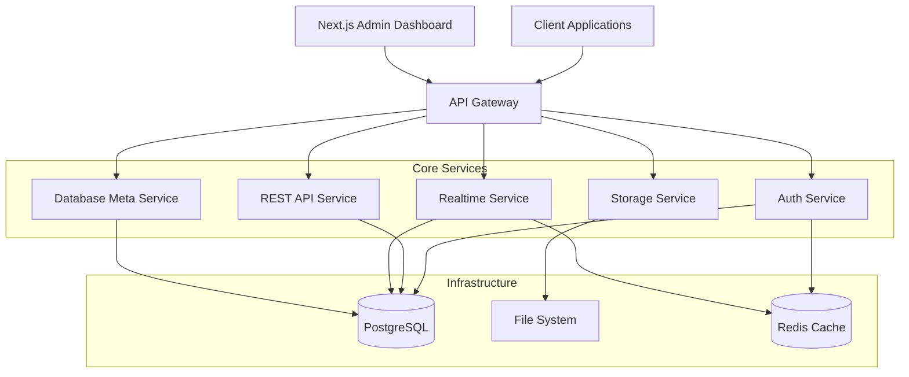

# Go Forward Framework

A comprehensive, production-ready backend framework built with Go, featuring authentication, database management with real-time capabilities, auto-generated APIs, file storage, plugin architecture, and an admin dashboard. Designed as a Supabase alternative with PocketBase-like flexibility.

## 🚀 Features

### Core Features
- **🔐 Multi-Method Authentication**: Email/Phone OTP, traditional credentials, OAuth providers, and custom auth models
- **🗄️ PostgreSQL Database**: With real-time capabilities, Row Level Security (RLS), and automatic migrations
- **⚡ Auto-Generated REST APIs**: Automatic CRUD endpoints from database schema with filtering and pagination
- **🔄 Real-time Features**: WebSocket support with database change streaming and presence tracking
- **📁 File Storage**: Local and S3-compatible storage with granular access controls
- **🎛️ Admin Dashboard**: Next.js-based admin interface for complete system management
- **🔧 Migration Management**: CLI and web-based database migrations with rollback support
- **🧩 Plugin Architecture**: Extensible plugin system for custom functionality
- **📊 Comprehensive Configuration**: YAML-based config with environment variable overrides
- **🐳 Docker Ready**: Complete Docker and Docker Compose setup for all environments

### Advanced Features
- **Row Level Security (RLS)**: Database-level security policies
- **Custom Authentication Providers**: LDAP, API keys, social logins
- **Real-time Database Changes**: Live updates via WebSocket connections
- **Automatic API Documentation**: OpenAPI/Swagger documentation generation
- **Health Checks**: Built-in health monitoring and status endpoints
- **Rate Limiting**: Configurable rate limiting per endpoint
- **CORS Support**: Flexible CORS configuration
- **Logging**: Structured logging with multiple output formats
- **Backup & Recovery**: Automated backup scripts and recovery procedures

## 🏗️ Architecture



## 🚀 Quick Start

### Option 1: Docker Deployment (Recommended)

1. **Clone and Setup**
   ```bash
   git clone https://github.com/taqiudeen275/go-forward.git
   cd go-forward
   cp .env.example .env
   ```

2. **Configure Environment**
   ```bash
   # Edit .env with your settings
   nano .env
   ```

3. **Deploy**
   ```bash
   chmod +x scripts/deploy.sh
   ./scripts/deploy.sh
   ```

4. **Access Applications**
   - **API**: http://localhost:8080
   - **Admin Dashboard**: http://localhost:8080/admin
   - **API Documentation**: http://localhost:8080/docs
   - **Health Check**: http://localhost:8080/health

### Option 2: Manual Installation

1. **Prerequisites**
   - Go 1.21 or later
   - PostgreSQL 13 or later
   - Redis 6 or later (optional)

2. **Installation**
   ```bash
   git clone https://github.com/taqiudeen275/go-forward.git
   cd go-forward
   go mod download
   ```

3. **Configuration**
   ```bash
   cp config.example.yaml config.yaml
   # Edit config.yaml with your database and other settings
   ```

4. **Database Setup**
   ```bash
   # Run migrations
   go run cmd/migrate/main.go up
   ```

5. **Start the Server**
   ```bash
   go run cmd/server/main.go
   ```

## 📖 Documentation

### Core Documentation
- **[Deployment Guide](DEPLOYMENT.md)** - Complete deployment instructions
- **[API Documentation](API_COMPREHENSIVE_DOCUMENTATION.md)** - Comprehensive API reference
- **[Authentication Guide](AUTH_DOCUMENTATION.md)** - Authentication methods and configuration
- **[Database Documentation](DATABASE_DOCUMENTATION.md)** - Database operations and management
- **[Real-time Features](REALTIME_DOCUMENTATION.md)** - WebSocket and live updates
- **[Migration CLI](MIGRATE_CLI_DOCUMENTATION.md)** - Database migration management
- **[Setup Guide](SETUP.md)** - Detailed setup instructions

### Feature Guides
- **[OTP Authentication](OTP_AUTH_README.md)** - OTP setup and usage
- **[OTP Verification Guide](OTP_VERIFICATION_GUIDE.md)** - Step-by-step OTP verification
- **[Plugin Development](examples/plugins/README.md)** - Creating custom plugins
- **[Framework Status](FRAMEWORK_STATUS.md)** - Current implementation status

## 🔧 Configuration

The framework uses YAML configuration with environment variable overrides:

```yaml
server:
  host: "localhost"
  port: 8080
  cors:
    allowed_origins: ["*"]
    allowed_methods: ["GET", "POST", "PUT", "DELETE", "OPTIONS"]

database:
  host: "localhost"
  port: 5432
  name: "goforward"
  user: "postgres"
  password: "password"
  ssl_mode: "disable"

auth:
  jwt_secret: "your-super-secret-jwt-key"
  jwt_expiration: "24h"
  enable_email_auth: true
  enable_phone_auth: true
  smtp:
    host: "smtp.gmail.com"
    port: 587
    username: "your-email@gmail.com"
    password: "your-app-password"

storage:
  provider: "local"  # or "s3"
  local_path: "./storage"
  max_file_size: 10485760  # 10MB

realtime:
  enabled: true
  max_connections: 1000

plugins:
  enabled: true
  directory: "./plugins"
```

## 🔌 Plugin System

Go Forward features a powerful plugin architecture:

```go
// Example HTTP plugin
type MyPlugin struct {
    *plugin.BasePlugin
}

func (p *MyPlugin) Routes() []plugin.Route {
    return []plugin.Route{
        {
            Method:  "GET",
            Path:    "/api/my-plugin/hello",
            Handler: p.handleHello,
        },
    }
}

// Build as shared library
// go build -buildmode=plugin -o my-plugin.so
```

See [Plugin Development Guide](examples/plugins/README.md) for details.

## 🌐 API Examples

### Authentication
```bash
# Register user with email
curl -X POST http://localhost:8080/auth/register \
  -H "Content-Type: application/json" \
  -d '{"email": "user@example.com", "password": "password123"}'

# Send OTP to phone
curl -X POST http://localhost:8080/auth/otp/send \
  -H "Content-Type: application/json" \
  -d '{"phone": "+1234567890", "purpose": "login"}'

# Verify OTP
curl -X POST http://localhost:8080/auth/otp/verify \
  -H "Content-Type: application/json" \
  -d '{"phone": "+1234567890", "otp": "123456", "purpose": "login"}'
```

### Database Operations
```bash
# Create table
curl -X POST http://localhost:8080/api/meta/tables \
  -H "Authorization: Bearer <token>" \
  -H "Content-Type: application/json" \
  -d '{
    "name": "products",
    "columns": [
      {"name": "id", "type": "serial", "primary_key": true},
      {"name": "name", "type": "varchar(255)", "nullable": false},
      {"name": "price", "type": "decimal(10,2)"}
    ]
  }'

# Auto-generated CRUD endpoints
curl -X GET http://localhost:8080/api/products
curl -X POST http://localhost:8080/api/products \
  -H "Authorization: Bearer <token>" \
  -d '{"name": "Product 1", "price": 29.99}'
```

### Real-time Features
```javascript
// WebSocket connection
const ws = new WebSocket('ws://localhost:8080/ws');

// Subscribe to table changes
ws.send(JSON.stringify({
  type: 'subscribe',
  channel: 'table:products',
  filter: { price: { $gt: 20 } }
}));

// Receive real-time updates
ws.onmessage = (event) => {
  const data = JSON.parse(event.data);
  console.log('Real-time update:', data);
};
```

## 🏗️ Development

### Project Structure
```
├── cmd/                    # Application entry points
│   ├── server/            # Main server application
│   └── migrate/           # Migration CLI tool
├── internal/              # Private application code
│   ├── api/              # REST API handlers
│   ├── auth/             # Authentication service
│   ├── config/           # Configuration management
│   ├── database/         # Database operations
│   ├── gateway/          # API gateway
│   ├── realtime/         # Real-time features
│   ├── server/           # HTTP server
│   ├── sms/              # SMS providers
│   ├── storage/          # File storage
│   └── email/            # Email service
├── pkg/                   # Public packages
│   ├── errors/           # Error handling
│   ├── interfaces/       # Common interfaces
│   ├── logger/           # Logging utilities
│   └── plugin/           # Plugin system
├── migrations/           # Database migrations
├── examples/             # Example code and plugins
├── scripts/              # Deployment and utility scripts
├── config.yaml          # Configuration file
├── docker-compose.yml    # Docker composition
└── Dockerfile           # Container definition
```

### Building
```bash
# Build server
go build -o server cmd/server/main.go

# Build migration tool
go build -o migrate cmd/migrate/main.go

# Build with Docker
docker build -t goforward .
```

### Testing
```bash
# Run all tests
go test ./...

# Run with coverage
go test -cover ./...

# Run specific package tests
go test ./internal/auth/...
```

### Development Environment
```bash
# Start development environment
docker-compose -f docker-compose.dev.yml up -d

# Includes:
# - PostgreSQL on port 5433
# - Redis on port 6380
# - Adminer on port 8081
# - Redis Commander on port 8082
```

## 🚀 Deployment

### Production Deployment
```bash
# Production deployment
./scripts/deploy.sh production

# Or manually
docker-compose -f docker-compose.prod.yml up -d
```

### Environment Configurations
- **Development**: `docker-compose.dev.yml` - Development tools and debugging
- **Production**: `docker-compose.prod.yml` - Optimized for production with SSL, monitoring
- **Default**: `docker-compose.yml` - Standard configuration

### Backup and Recovery
```bash
# Create backup
./scripts/backup.sh full

# Restore from backup
./scripts/backup.sh restore 20231201_143000

# Automated daily backups
crontab -e
# Add: 0 2 * * * /path/to/go-forward/scripts/backup.sh full
```

## 🔒 Security Features

- **JWT Authentication** with configurable expiration
- **Row Level Security (RLS)** for database access control
- **Rate Limiting** to prevent abuse
- **CORS Configuration** for cross-origin requests
- **Input Validation** and sanitization
- **Secure Password Hashing** with bcrypt
- **SSL/TLS Support** for production deployments
- **API Key Authentication** for service-to-service calls

## 📊 Monitoring and Observability

- **Health Check Endpoints** for service monitoring
- **Structured Logging** with JSON output
- **Metrics Collection** ready for Prometheus
- **Request Tracing** for debugging
- **Error Tracking** with detailed error responses
- **Performance Monitoring** with built-in profiling

## 🤝 Contributing

We welcome contributions! Please see our contributing guidelines:

1. **Fork the repository**
2. **Create a feature branch**: `git checkout -b feature/amazing-feature`
3. **Make your changes** and add tests
4. **Commit your changes**: `git commit -m 'Add amazing feature'`
5. **Push to the branch**: `git push origin feature/amazing-feature`
6. **Submit a pull request**

### Development Guidelines
- Follow Go best practices and conventions
- Add tests for new functionality
- Update documentation for API changes
- Use conventional commit messages
- Ensure all tests pass before submitting

## 📄 License

This project is licensed under the MIT License - see the [LICENSE](LICENSE) file for details.

## 🆘 Support

- **Documentation**: [Complete documentation](docs/)
- **Issues**: [GitHub Issues](https://github.com/taqiudeen275/go-forward/issues)
- **Discussions**: [GitHub Discussions](https://github.com/taqiudeen275/go-forward/discussions)
- **Wiki**: [Project Wiki](https://github.com/taqiudeen275/go-forward/wiki)

## 🗺️ Roadmap

- [ ] **GraphQL API** support
- [ ] **Kubernetes** deployment manifests
- [ ] **Multi-tenant** architecture
- [ ] **Advanced Analytics** dashboard
- [ ] **Workflow Engine** for business processes
- [ ] **API Gateway** with advanced routing
- [ ] **Microservices** architecture support
- [ ] **Event Sourcing** capabilities

## ⭐ Star History

If you find this project useful, please consider giving it a star on GitHub!

---

**Go Forward Framework** - Build powerful backends with ease. 🚀