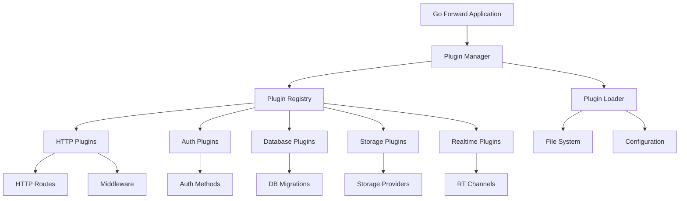
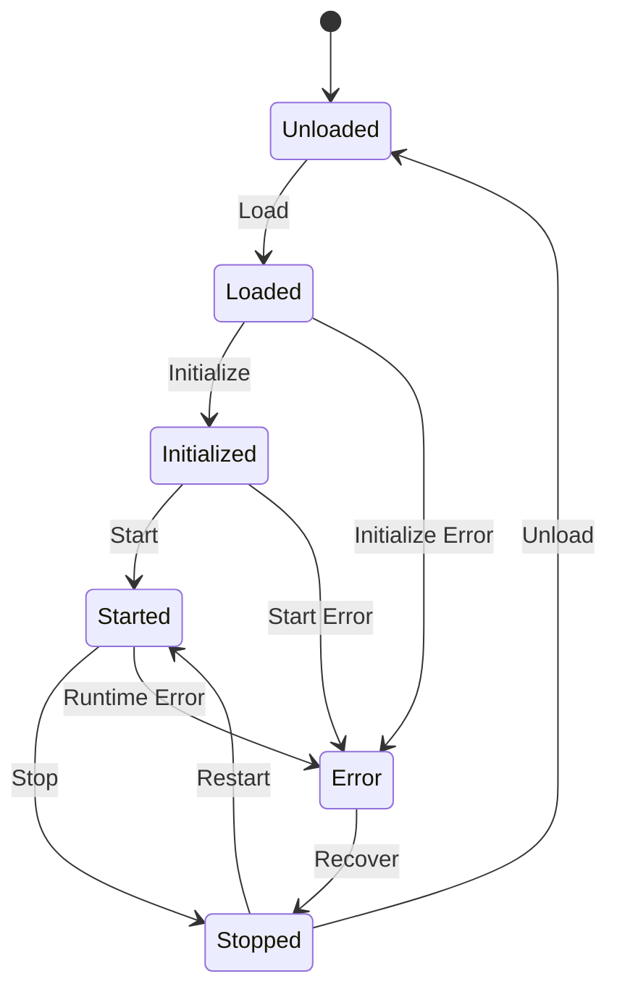

# Go Forward Plugin System Documentation

## Table of Contents

1. [Overview](#overview)
2. [Plugin Architecture](#plugin-architecture)
3. [Plugin Types](#plugin-types)
4. [Getting Started](#getting-started)
5. [Plugin Development](#plugin-development)
6. [Configuration](#configuration)
7. [Lifecycle Management](#lifecycle-management)
8. [Advanced Features](#advanced-features)
9. [Best Practices](#best-practices)
10. [Troubleshooting](#troubleshooting)
11. [API Reference](#api-reference)
12. [Examples](#examples)

## Overview

The Go Forward Plugin System is a powerful extensibility framework that allows developers to add custom functionality without modifying the core codebase. It supports hot-loading, dependency management, and provides a clean interface for extending various aspects of the framework.

### Key Features

- **🔌 Hot-Loading**: Load and unload plugins without restarting the application
- **🏗️ Multiple Plugin Types**: HTTP, Auth, Database, Storage, and Realtime plugins
- **📦 Dependency Management**: Handle plugin dependencies automatically
- **⚙️ Configuration Management**: Per-plugin configuration with validation
- **🔄 Lifecycle Management**: Initialize, start, stop, and health check plugins
- **🛡️ Security**: Sandboxed plugin execution with controlled access
- **📊 Monitoring**: Built-in health checks and status monitoring

### Architecture Overview



## Plugin Architecture

### Core Components

#### 1. Plugin Interface
The base interface that all plugins must implement:

```go
type Plugin interface {
    Name() string                    // Unique plugin identifier
    Version() string                 // Plugin version (semver)
    Description() string             // Human-readable description
    Initialize(ctx context.Context, config map[string]interface{}) error
    Start(ctx context.Context) error
    Stop(ctx context.Context) error
    Health(ctx context.Context) error
}
```

#### 2. Plugin Manager
Central coordinator that manages the entire plugin ecosystem:

```go
type PluginManager interface {
    PluginRegistry  // Plugin registration and lifecycle
    PluginLoader    // Plugin loading from various sources
    
    SetConfig(config map[string]PluginConfig)
    GetConfig() map[string]PluginConfig
    Reload(ctx context.Context) error
}
```

#### 3. Plugin Registry
Manages registered plugins and their lifecycle:

```go
type PluginRegistry interface {
    Register(plugin Plugin) error
    Unregister(name string) error
    Get(name string) (Plugin, error)
    List() []Plugin
    ListByType(pluginType string) []Plugin
    Initialize(ctx context.Context) error
    Start(ctx context.Context) error
    Stop(ctx context.Context) error
    Health(ctx context.Context) map[string]error
}
```

#### 4. Plugin Loader
Loads plugins from various sources:

```go
type PluginLoader interface {
    LoadFromDirectory(dir string) ([]Plugin, error)
    LoadFromFile(path string) (Plugin, error)
    LoadFromConfig(config map[string]PluginConfig) ([]Plugin, error)
}
```

## Plugin Types

### 1. HTTP Plugins

HTTP plugins extend the web server functionality by adding custom routes and middleware.

```go
type HTTPPlugin interface {
    Plugin
    Routes() []Route
    Middleware() []func(http.Handler) http.Handler
}

type Route struct {
    Method  string           // HTTP method (GET, POST, etc.)
    Path    string           // URL path pattern
    Handler http.HandlerFunc // Request handler
}
```

**Use Cases:**
- Custom API endpoints
- Request/response transformation
- Authentication middleware
- Rate limiting
- Logging and analytics
- CORS handling

**Example:**
```go
type PaymentPlugin struct {
    *plugin.BasePlugin
}

func (p *PaymentPlugin) Routes() []plugin.Route {
    return []plugin.Route{
        {
            Method:  "POST",
            Path:    "/api/payments/process",
            Handler: p.processPayment,
        },
        {
            Method:  "GET",
            Path:    "/api/payments/status/:id",
            Handler: p.getPaymentStatus,
        },
    }
}

func (p *PaymentPlugin) Middleware() []func(http.Handler) http.Handler {
    return []func(http.Handler) http.Handler{
        p.paymentLoggingMiddleware,
        p.paymentValidationMiddleware,
    }
}
```

### 2. Authentication Plugins

Authentication plugins provide custom authentication methods and credential validation.

```go
type AuthPlugin interface {
    Plugin
    AuthMethods() []AuthMethod
    ValidateCredentials(ctx context.Context, method string, 
                       credentials map[string]interface{}) (*AuthResult, error)
}

type AuthMethod struct {
    Name        string // Method identifier
    Type        string // Method type (oauth, ldap, api_key, etc.)
    Description string // Human-readable description
}

type AuthResult struct {
    Success   bool                   // Authentication success
    UserID    string                 // User identifier
    UserData  map[string]interface{} // Additional user data
    Token     string                 // Authentication token
    ExpiresAt int64                  // Token expiration timestamp
}
```

**Use Cases:**
- LDAP integration
- OAuth providers (Google, GitHub, etc.)
- API key authentication
- Multi-factor authentication
- Custom authentication protocols
- SSO integration

**Example:**
```go
type LDAPAuthPlugin struct {
    *plugin.BasePlugin
    ldapClient *ldap.Client
}

func (p *LDAPAuthPlugin) AuthMethods() []plugin.AuthMethod {
    return []plugin.AuthMethod{
        {
            Name:        "ldap",
            Type:        "ldap",
            Description: "LDAP Directory Authentication",
        },
    }
}

func (p *LDAPAuthPlugin) ValidateCredentials(ctx context.Context, 
    method string, credentials map[string]interface{}) (*plugin.AuthResult, error) {
    
    if method != "ldap" {
        return nil, fmt.Errorf("unsupported method: %s", method)
    }
    
    username := credentials["username"].(string)
    password := credentials["password"].(string)
    
    // LDAP validation logic
    user, err := p.ldapClient.Authenticate(username, password)
    if err != nil {
        return &plugin.AuthResult{Success: false}, nil
    }
    
    return &plugin.AuthResult{
        Success:  true,
        UserID:   user.ID,
        UserData: map[string]interface{}{
            "email":      user.Email,
            "department": user.Department,
            "role":       user.Role,
        },
    }, nil
}
```

### 3. Database Plugins

Database plugins extend database functionality with custom migrations and hooks.

```go
type DatabasePlugin interface {
    Plugin
    Migrations() []Migration
    Hooks() []DatabaseHook
}

type Migration struct {
    ID      string // Unique migration identifier
    Name    string // Migration name
    UpSQL   string // Forward migration SQL
    DownSQL string // Rollback migration SQL
}

type DatabaseHook struct {
    Name     string // Hook name
    Table    string // Target table
    Event    string // Trigger event (INSERT, UPDATE, DELETE)
    Function string // Database function to execute
}
```

**Use Cases:**
- Custom table schemas
- Data validation triggers
- Audit logging
- Data transformation
- Custom indexes
- Stored procedures

**Example:**
```go
type AuditPlugin struct {
    *plugin.BasePlugin
}

func (p *AuditPlugin) Migrations() []plugin.Migration {
    return []plugin.Migration{
        {
            ID:   "001_create_audit_log",
            Name: "Create audit log table",
            UpSQL: `
                CREATE TABLE audit_log (
                    id SERIAL PRIMARY KEY,
                    table_name VARCHAR(255) NOT NULL,
                    operation VARCHAR(50) NOT NULL,
                    old_data JSONB,
                    new_data JSONB,
                    user_id INTEGER,
                    timestamp TIMESTAMP DEFAULT NOW()
                );
                
                CREATE INDEX idx_audit_log_table ON audit_log(table_name);
                CREATE INDEX idx_audit_log_timestamp ON audit_log(timestamp);
            `,
            DownSQL: `
                DROP TABLE audit_log;
            `,
        },
    }
}

func (p *AuditPlugin) Hooks() []plugin.DatabaseHook {
    return []plugin.DatabaseHook{
        {
            Name:     "audit_users_changes",
            Table:    "users",
            Event:    "UPDATE",
            Function: "log_user_changes()",
        },
        {
            Name:     "audit_orders_changes",
            Table:    "orders",
            Event:    "INSERT",
            Function: "log_order_creation()",
        },
    }
}
```

### 4. Storage Plugins

Storage plugins provide custom storage backends and file handling.

```go
type StoragePlugin interface {
    Plugin
    StorageProviders() []StorageProvider
}

type StorageProvider struct {
    Name        string // Provider name
    Type        string // Provider type (s3, gcs, azure, etc.)
    Description string // Provider description
}
```

**Use Cases:**
- Cloud storage integration (AWS S3, Google Cloud, Azure)
- CDN integration
- Image processing
- File encryption
- Backup systems
- Custom file formats

### 5. Realtime Plugins

Realtime plugins extend WebSocket functionality with custom channels and message handlers.

```go
type RealtimePlugin interface {
    Plugin
    Channels() []RealtimeChannel
    MessageHandlers() []MessageHandler
}

type RealtimeChannel struct {
    Name        string // Channel name
    Pattern     string // Channel pattern (supports wildcards)
    Description string // Channel description
}

type MessageHandler struct {
    Channel string                                              // Target channel
    Event   string                                              // Event type
    Handler func(ctx context.Context, message interface{}) error // Handler function
}
```

**Use Cases:**
- Custom real-time notifications
- Live chat systems
- Collaborative editing
- Live data feeds
- Gaming features
- IoT device communication

## Getting Started

### Prerequisites

- Go 1.21 or later
- Go Forward framework installed
- Basic understanding of Go interfaces

### Quick Start

#### 1. Create Your First Plugin

```go
// hello-plugin.go
package main

import (
    "context"
    "encoding/json"
    "net/http"
    
    "github.com/taqiudeen275/go-foward/pkg/plugin"
)

type HelloPlugin struct {
    *plugin.BasePlugin
}

func NewHelloPlugin() *HelloPlugin {
    return &HelloPlugin{
        BasePlugin: plugin.NewBasePlugin(
            "hello-world",
            "1.0.0", 
            "A simple hello world plugin",
        ),
    }
}

func (p *HelloPlugin) Routes() []plugin.Route {
    return []plugin.Route{
        {
            Method:  "GET",
            Path:    "/api/hello",
            Handler: p.handleHello,
        },
    }
}

func (p *HelloPlugin) handleHello(w http.ResponseWriter, r *http.Request) {
    response := map[string]string{
        "message": "Hello from plugin!",
        "plugin":  p.Name(),
        "version": p.Version(),
    }
    
    w.Header().Set("Content-Type", "application/json")
    json.NewEncoder(w).Encode(response)
}

// Plugin is the exported symbol that the plugin loader looks for
var Plugin = NewHelloPlugin()
```

#### 2. Build the Plugin

```bash
go build -buildmode=plugin -o hello-plugin.so hello-plugin.go
```

#### 3. Install the Plugin

```bash
# Copy to plugins directory
cp hello-plugin.so ./plugins/

# Or create plugin metadata (optional)
cat > ./plugins/hello-plugin.json << EOF
{
    "name": "hello-world",
    "version": "1.0.0",
    "description": "A simple hello world plugin",
    "author": "Your Name",
    "license": "MIT",
    "enabled": true
}
EOF
```

#### 4. Configure the Plugin

```yaml
# config.yaml
plugins:
  enabled: true
  directory: "./plugins"
  plugins:
    hello-world:
      enabled: true
      priority: 10
      config:
        greeting: "Hello from configuration!"
```

#### 5. Test the Plugin

```bash
# Start the server
go run cmd/server/main.go

# Test the plugin endpoint
curl http://localhost:8080/api/hello
```

## Plugin Development

### Development Workflow

#### 1. Setup Development Environment

```bash
# Create plugin development directory
mkdir my-plugin
cd my-plugin

# Initialize Go module
go mod init my-plugin

# Add Go Forward dependency
go get github.com/taqiudeen275/go-foward
```

#### 2. Plugin Structure

```
my-plugin/
├── main.go              # Plugin implementation
├── config.go            # Configuration structures
├── handlers.go          # HTTP handlers
├── models.go            # Data models
├── services.go          # Business logic
├── metadata.json        # Plugin metadata
├── go.mod              # Go module
└── README.md           # Plugin documentation
```

#### 3. Base Plugin Implementation

```go
// main.go
package main

import (
    "context"
    "fmt"
    
    "github.com/taqiudeen275/go-foward/pkg/plugin"
)

type MyPlugin struct {
    *plugin.BasePlugin
    config *Config
}

func NewMyPlugin() *MyPlugin {
    return &MyPlugin{
        BasePlugin: plugin.NewBasePlugin(
            "my-plugin",
            "1.0.0",
            "My custom plugin description",
        ),
    }
}

func (p *MyPlugin) Initialize(ctx context.Context, config map[string]interface{}) error {
    // Call base initialization
    if err := p.BasePlugin.Initialize(ctx, config); err != nil {
        return err
    }
    
    // Parse plugin-specific configuration
    p.config = &Config{}
    if err := p.parseConfig(config); err != nil {
        return fmt.Errorf("failed to parse config: %w", err)
    }
    
    // Initialize plugin resources
    if err := p.initializeResources(); err != nil {
        return fmt.Errorf("failed to initialize resources: %w", err)
    }
    
    return nil
}

func (p *MyPlugin) Start(ctx context.Context) error {
    if err := p.BasePlugin.Start(ctx); err != nil {
        return err
    }
    
    // Start plugin-specific services
    return p.startServices()
}

func (p *MyPlugin) Stop(ctx context.Context) error {
    // Stop plugin-specific services
    p.stopServices()
    
    return p.BasePlugin.Stop(ctx)
}

func (p *MyPlugin) Health(ctx context.Context) error {
    if err := p.BasePlugin.Health(ctx); err != nil {
        return err
    }
    
    // Check plugin-specific health
    return p.checkHealth()
}

// Export the plugin
var Plugin = NewMyPlugin()
```

#### 4. Configuration Management

```go
// config.go
package main

import (
    "fmt"
    "reflect"
)

type Config struct {
    APIKey      string            `json:"api_key" validate:"required"`
    Timeout     int               `json:"timeout" default:"30"`
    EnableCache bool              `json:"enable_cache" default:"true"`
    Features    map[string]bool   `json:"features"`
    Endpoints   []EndpointConfig  `json:"endpoints"`
}

type EndpointConfig struct {
    Path   string `json:"path" validate:"required"`
    Method string `json:"method" validate:"required"`
    Auth   bool   `json:"auth" default:"true"`
}

func (p *MyPlugin) parseConfig(rawConfig map[string]interface{}) error {
    // Convert map to struct
    if err := mapToStruct(rawConfig, p.config); err != nil {
        return err
    }
    
    // Validate configuration
    if err := p.validateConfig(); err != nil {
        return err
    }
    
    return nil
}

func (p *MyPlugin) validateConfig() error {
    if p.config.APIKey == "" {
        return fmt.Errorf("api_key is required")
    }
    
    if p.config.Timeout <= 0 {
        return fmt.Errorf("timeout must be positive")
    }
    
    for _, endpoint := range p.config.Endpoints {
        if endpoint.Path == "" {
            return fmt.Errorf("endpoint path cannot be empty")
        }
        if endpoint.Method == "" {
            return fmt.Errorf("endpoint method cannot be empty")
        }
    }
    
    return nil
}
```

### Advanced Plugin Features

#### 1. Plugin Dependencies

```go
// Declare dependencies in metadata
{
    "name": "advanced-plugin",
    "version": "1.0.0",
    "dependencies": ["auth-plugin", "database-plugin"],
    "config": {
        "requires_auth": true,
        "requires_database": true
    }
}
```

```go
// Check dependencies in plugin
func (p *MyPlugin) Initialize(ctx context.Context, config map[string]interface{}) error {
    // Check if required plugins are available
    if p.config.RequiresAuth {
        if !p.isPluginAvailable("auth-plugin") {
            return fmt.Errorf("auth-plugin is required but not available")
        }
    }
    
    return p.BasePlugin.Initialize(ctx, config)
}
```

#### 2. Inter-Plugin Communication

```go
// Plugin A exposes a service
type ServiceA interface {
    ProcessData(data []byte) ([]byte, error)
}

func (p *PluginA) GetService() ServiceA {
    return p.service
}

// Plugin B uses Plugin A's service
func (p *PluginB) Initialize(ctx context.Context, config map[string]interface{}) error {
    // Get reference to Plugin A
    pluginA, err := p.manager.Get("plugin-a")
    if err != nil {
        return err
    }
    
    // Use Plugin A's service
    if serviceProvider, ok := pluginA.(interface{ GetService() ServiceA }); ok {
        p.serviceA = serviceProvider.GetService()
    }
    
    return p.BasePlugin.Initialize(ctx, config)
}
```

#### 3. Event System

```go
// Event definitions
type PluginEvent struct {
    Type      string                 `json:"type"`
    Source    string                 `json:"source"`
    Data      map[string]interface{} `json:"data"`
    Timestamp time.Time              `json:"timestamp"`
}

// Event emitter
func (p *MyPlugin) EmitEvent(eventType string, data map[string]interface{}) {
    event := PluginEvent{
        Type:      eventType,
        Source:    p.Name(),
        Data:      data,
        Timestamp: time.Now(),
    }
    
    p.eventBus.Emit(event)
}

// Event listener
func (p *MyPlugin) OnEvent(event PluginEvent) {
    switch event.Type {
    case "user.created":
        p.handleUserCreated(event.Data)
    case "order.completed":
        p.handleOrderCompleted(event.Data)
    }
}
```

## Configuration

### Plugin Configuration Structure

```yaml
plugins:
  enabled: true                    # Enable/disable plugin system
  directory: "./plugins"           # Plugin directory path
  auto_reload: false              # Auto-reload on file changes
  max_plugins: 100                # Maximum number of plugins
  timeout: "30s"                  # Plugin operation timeout
  
  plugins:
    plugin-name:
      enabled: true               # Enable/disable this plugin
      priority: 10                # Loading priority (higher = first)
      auto_start: true            # Auto-start with application
      config:                     # Plugin-specific configuration
        setting1: "value1"
        setting2: 42
        setting3: true
      dependencies: ["other-plugin"] # Plugin dependencies
      metadata:                   # Additional metadata
        author: "Plugin Author"
        license: "MIT"
        homepage: "https://example.com"
```

### Environment Variable Overrides

```bash
# Global plugin settings
GOFORWARD_PLUGINS_ENABLED=true
GOFORWARD_PLUGINS_DIRECTORY=./plugins
GOFORWARD_PLUGINS_AUTO_RELOAD=false

# Plugin-specific settings
GOFORWARD_PLUGINS_MYPLUGIN_ENABLED=true
GOFORWARD_PLUGINS_MYPLUGIN_PRIORITY=10
GOFORWARD_PLUGINS_MYPLUGIN_CONFIG_API_KEY=secret-key
```

### Configuration Validation

```go
type PluginConfigValidator struct {
    rules map[string]ValidationRule
}

type ValidationRule struct {
    Required bool
    Type     string
    Min      interface{}
    Max      interface{}
    Pattern  string
    Options  []interface{}
}

func (v *PluginConfigValidator) Validate(config map[string]interface{}) error {
    for key, rule := range v.rules {
        value, exists := config[key]
        
        if rule.Required && !exists {
            return fmt.Errorf("required field %s is missing", key)
        }
        
        if exists {
            if err := v.validateValue(key, value, rule); err != nil {
                return err
            }
        }
    }
    
    return nil
}
```

## Lifecycle Management

### Plugin States

```go
type PluginState int

const (
    StateUnloaded PluginState = iota
    StateLoaded
    StateInitialized
    StateStarted
    StateStopped
    StateError
)
```

### State Transitions



### Lifecycle Hooks

```go
type PluginLifecycleHooks struct {
    BeforeLoad      func(name string) error
    AfterLoad       func(plugin Plugin) error
    BeforeInit      func(plugin Plugin) error
    AfterInit       func(plugin Plugin) error
    BeforeStart     func(plugin Plugin) error
    AfterStart      func(plugin Plugin) error
    BeforeStop      func(plugin Plugin) error
    AfterStop       func(plugin Plugin) error
    OnError         func(plugin Plugin, err error)
}
```

### Health Monitoring

```go
type HealthStatus struct {
    Status    string                 `json:"status"`    // healthy, unhealthy, unknown
    Message   string                 `json:"message"`   // Status message
    Details   map[string]interface{} `json:"details"`   // Additional details
    Timestamp time.Time              `json:"timestamp"` // Check timestamp
}

func (p *MyPlugin) Health(ctx context.Context) error {
    // Check database connection
    if err := p.db.Ping(); err != nil {
        return fmt.Errorf("database connection failed: %w", err)
    }
    
    // Check external API
    if err := p.checkExternalAPI(); err != nil {
        return fmt.Errorf("external API check failed: %w", err)
    }
    
    // Check resource usage
    if p.getMemoryUsage() > p.config.MaxMemory {
        return fmt.Errorf("memory usage exceeded limit")
    }
    
    return nil
}
```

## Advanced Features

### 1. Plugin Sandboxing

```go
type PluginSandbox struct {
    memoryLimit int64
    cpuLimit    float64
    networkAccess bool
    fileSystemAccess bool
}

func (s *PluginSandbox) Execute(plugin Plugin, operation func() error) error {
    // Set resource limits
    if err := s.setResourceLimits(); err != nil {
        return err
    }
    
    // Execute with timeout
    ctx, cancel := context.WithTimeout(context.Background(), 30*time.Second)
    defer cancel()
    
    done := make(chan error, 1)
    go func() {
        done <- operation()
    }()
    
    select {
    case err := <-done:
        return err
    case <-ctx.Done():
        return fmt.Errorf("operation timed out")
    }
}
```

### 2. Plugin Metrics

```go
type PluginMetrics struct {
    LoadTime      time.Duration
    InitTime      time.Duration
    StartTime     time.Duration
    RequestCount  int64
    ErrorCount    int64
    MemoryUsage   int64
    CPUUsage      float64
    LastActivity  time.Time
}

func (p *MyPlugin) RecordMetric(metric string, value interface{}) {
    p.metrics.Record(metric, value, time.Now())
}

func (p *MyPlugin) GetMetrics() PluginMetrics {
    return p.metrics.GetSnapshot()
}
```

### 3. Plugin Versioning

```go
type PluginVersion struct {
    Major int
    Minor int
    Patch int
    Pre   string
}

func (v PluginVersion) String() string {
    version := fmt.Sprintf("%d.%d.%d", v.Major, v.Minor, v.Patch)
    if v.Pre != "" {
        version += "-" + v.Pre
    }
    return version
}

func (v PluginVersion) Compatible(other PluginVersion) bool {
    // Major version must match
    if v.Major != other.Major {
        return false
    }
    
    // Minor version must be >= required
    if v.Minor < other.Minor {
        return false
    }
    
    return true
}
```

### 4. Hot Reloading

```go
type HotReloader struct {
    watcher  *fsnotify.Watcher
    manager  PluginManager
    debounce time.Duration
}

func (hr *HotReloader) Watch(directory string) error {
    return hr.watcher.Add(directory)
}

func (hr *HotReloader) handleFileEvent(event fsnotify.Event) {
    if filepath.Ext(event.Name) != ".so" {
        return
    }
    
    pluginName := strings.TrimSuffix(filepath.Base(event.Name), ".so")
    
    switch event.Op {
    case fsnotify.Write, fsnotify.Create:
        hr.reloadPlugin(pluginName)
    case fsnotify.Remove:
        hr.unloadPlugin(pluginName)
    }
}

func (hr *HotReloader) reloadPlugin(name string) error {
    // Stop existing plugin
    if err := hr.manager.Stop(context.Background()); err != nil {
        return err
    }
    
    // Unregister plugin
    hr.manager.Unregister(name)
    
    // Load new version
    plugin, err := hr.manager.LoadFromFile(filepath.Join(hr.directory, name+".so"))
    if err != nil {
        return err
    }
    
    // Register and start
    if err := hr.manager.Register(plugin); err != nil {
        return err
    }
    
    return hr.manager.Start(context.Background())
}
```

## Best Practices

### 1. Plugin Design Principles

#### Single Responsibility
```go
// Good: Plugin focused on one feature
type PaymentPlugin struct {
    *plugin.BasePlugin
}

// Bad: Plugin doing too many things
type EverythingPlugin struct {
    *plugin.BasePlugin
    // payment, inventory, auth, reporting, etc.
}
```

#### Interface Segregation
```go
// Good: Specific interfaces
type PaymentProcessor interface {
    ProcessPayment(amount float64, method string) error
}

type PaymentValidator interface {
    ValidatePayment(payment Payment) error
}

// Bad: Fat interface
type PaymentService interface {
    ProcessPayment(amount float64, method string) error
    ValidatePayment(payment Payment) error
    RefundPayment(id string) error
    GetPaymentHistory(userID string) []Payment
    // ... many more methods
}
```

#### Dependency Injection
```go
// Good: Dependencies injected
type EmailPlugin struct {
    *plugin.BasePlugin
    emailService EmailService
    logger       Logger
}

func (p *EmailPlugin) Initialize(ctx context.Context, config map[string]interface{}) error {
    // Inject dependencies
    p.emailService = p.getEmailService()
    p.logger = p.getLogger()
    return p.BasePlugin.Initialize(ctx, config)
}

// Bad: Hard-coded dependencies
type EmailPlugin struct {
    *plugin.BasePlugin
}

func (p *EmailPlugin) sendEmail() {
    // Hard-coded SMTP client
    smtp.SendMail("smtp.gmail.com:587", nil, "from", []string{"to"}, []byte("body"))
}
```

### 2. Error Handling

#### Graceful Degradation
```go
func (p *MyPlugin) processRequest(req Request) Response {
    // Try primary service
    if result, err := p.primaryService.Process(req); err == nil {
        return result
    }
    
    // Fallback to secondary service
    if result, err := p.secondaryService.Process(req); err == nil {
        p.logger.Warn("Primary service failed, used fallback")
        return result
    }
    
    // Return error response
    return Response{
        Error: "Service temporarily unavailable",
        Code:  503,
    }
}
```

#### Error Wrapping
```go
func (p *MyPlugin) Initialize(ctx context.Context, config map[string]interface{}) error {
    if err := p.BasePlugin.Initialize(ctx, config); err != nil {
        return fmt.Errorf("base initialization failed: %w", err)
    }
    
    if err := p.connectToDatabase(); err != nil {
        return fmt.Errorf("database connection failed: %w", err)
    }
    
    if err := p.loadConfiguration(); err != nil {
        return fmt.Errorf("configuration loading failed: %w", err)
    }
    
    return nil
}
```

### 3. Performance Optimization

#### Resource Management
```go
type ResourceManager struct {
    connections map[string]*sql.DB
    mutex       sync.RWMutex
    maxConns    int
}

func (rm *ResourceManager) GetConnection(name string) (*sql.DB, error) {
    rm.mutex.RLock()
    if conn, exists := rm.connections[name]; exists {
        rm.mutex.RUnlock()
        return conn, nil
    }
    rm.mutex.RUnlock()
    
    rm.mutex.Lock()
    defer rm.mutex.Unlock()
    
    // Double-check after acquiring write lock
    if conn, exists := rm.connections[name]; exists {
        return conn, nil
    }
    
    // Create new connection
    conn, err := rm.createConnection(name)
    if err != nil {
        return nil, err
    }
    
    rm.connections[name] = conn
    return conn, nil
}
```

#### Caching
```go
type CachePlugin struct {
    *plugin.BasePlugin
    cache map[string]CacheEntry
    mutex sync.RWMutex
    ttl   time.Duration
}

type CacheEntry struct {
    Value     interface{}
    ExpiresAt time.Time
}

func (p *CachePlugin) Get(key string) (interface{}, bool) {
    p.mutex.RLock()
    defer p.mutex.RUnlock()
    
    entry, exists := p.cache[key]
    if !exists || time.Now().After(entry.ExpiresAt) {
        return nil, false
    }
    
    return entry.Value, true
}

func (p *CachePlugin) Set(key string, value interface{}) {
    p.mutex.Lock()
    defer p.mutex.Unlock()
    
    p.cache[key] = CacheEntry{
        Value:     value,
        ExpiresAt: time.Now().Add(p.ttl),
    }
}
```

### 4. Security Considerations

#### Input Validation
```go
func (p *MyPlugin) validateInput(input map[string]interface{}) error {
    // Check required fields
    requiredFields := []string{"user_id", "amount", "currency"}
    for _, field := range requiredFields {
        if _, exists := input[field]; !exists {
            return fmt.Errorf("required field %s is missing", field)
        }
    }
    
    // Validate data types
    if userID, ok := input["user_id"].(string); !ok || userID == "" {
        return fmt.Errorf("user_id must be a non-empty string")
    }
    
    if amount, ok := input["amount"].(float64); !ok || amount <= 0 {
        return fmt.Errorf("amount must be a positive number")
    }
    
    // Sanitize strings
    if description, ok := input["description"].(string); ok {
        input["description"] = html.EscapeString(description)
    }
    
    return nil
}
```

#### Access Control
```go
func (p *MyPlugin) checkPermissions(userID string, action string) error {
    user, err := p.userService.GetUser(userID)
    if err != nil {
        return fmt.Errorf("user not found: %w", err)
    }
    
    if !user.HasPermission(action) {
        return fmt.Errorf("user %s does not have permission for action %s", userID, action)
    }
    
    return nil
}

func (p *MyPlugin) handleSecureEndpoint(w http.ResponseWriter, r *http.Request) {
    // Extract user from token
    userID, err := p.extractUserFromToken(r)
    if err != nil {
        http.Error(w, "Unauthorized", http.StatusUnauthorized)
        return
    }
    
    // Check permissions
    if err := p.checkPermissions(userID, "admin.access"); err != nil {
        http.Error(w, "Forbidden", http.StatusForbidden)
        return
    }
    
    // Process request
    p.processSecureRequest(w, r, userID)
}
```

## Troubleshooting

### Common Issues

#### 1. Plugin Loading Failures

**Problem**: Plugin fails to load with "symbol not found" error.

**Solution**:
```go
// Ensure the Plugin variable is exported
var Plugin = NewMyPlugin()

// Check that the plugin implements the required interface
var _ plugin.Plugin = (*MyPlugin)(nil)
```

**Problem**: Plugin loads but doesn't appear in the registry.

**Solution**:
```bash
# Check plugin file permissions
chmod 755 my-plugin.so

# Verify plugin directory configuration
ls -la ./plugins/

# Check plugin configuration
cat config.yaml | grep -A 10 plugins
```

#### 2. Configuration Issues

**Problem**: Plugin configuration not being applied.

**Solution**:
```go
func (p *MyPlugin) Initialize(ctx context.Context, config map[string]interface{}) error {
    // Debug configuration
    fmt.Printf("Plugin %s received config: %+v\n", p.Name(), config)
    
    // Validate configuration structure
    if err := p.validateConfig(config); err != nil {
        return fmt.Errorf("invalid configuration: %w", err)
    }
    
    return p.BasePlugin.Initialize(ctx, config)
}
```

#### 3. Dependency Issues

**Problem**: Plugin dependencies not resolved.

**Solution**:
```go
func (p *MyPlugin) Initialize(ctx context.Context, config map[string]interface{}) error {
    // Check dependencies explicitly
    for _, dep := range p.dependencies {
        if !p.manager.IsPluginLoaded(dep) {
            return fmt.Errorf("required dependency %s is not loaded", dep)
        }
    }
    
    return p.BasePlugin.Initialize(ctx, config)
}
```

### Debugging Tools

#### 1. Plugin Inspector

```go
type PluginInspector struct {
    manager PluginManager
}

func (pi *PluginInspector) InspectPlugin(name string) (*PluginInfo, error) {
    plugin, err := pi.manager.Get(name)
    if err != nil {
        return nil, err
    }
    
    info := &PluginInfo{
        Name:        plugin.Name(),
        Version:     plugin.Version(),
        Description: plugin.Description(),
        State:       pi.getPluginState(plugin),
        Health:      pi.getPluginHealth(plugin),
        Metrics:     pi.getPluginMetrics(plugin),
    }
    
    return info, nil
}

func (pi *PluginInspector) ListPlugins() []*PluginInfo {
    var infos []*PluginInfo
    
    for _, plugin := range pi.manager.List() {
        if info, err := pi.InspectPlugin(plugin.Name()); err == nil {
            infos = append(infos, info)
        }
    }
    
    return infos
}
```

#### 2. Plugin Profiler

```go
type PluginProfiler struct {
    profiles map[string]*Profile
    mutex    sync.RWMutex
}

type Profile struct {
    MemoryUsage   int64
    CPUUsage      float64
    RequestCount  int64
    AverageLatency time.Duration
    ErrorRate     float64
}

func (pp *PluginProfiler) StartProfiling(pluginName string) {
    pp.mutex.Lock()
    defer pp.mutex.Unlock()
    
    pp.profiles[pluginName] = &Profile{}
    
    go pp.collectMetrics(pluginName)
}

func (pp *PluginProfiler) GetProfile(pluginName string) *Profile {
    pp.mutex.RLock()
    defer pp.mutex.RUnlock()
    
    return pp.profiles[pluginName]
}
```

### Logging and Monitoring

#### 1. Structured Logging

```go
type PluginLogger struct {
    logger *logrus.Logger
    plugin string
}

func (pl *PluginLogger) Info(message string, fields map[string]interface{}) {
    entry := pl.logger.WithFields(logrus.Fields{
        "plugin": pl.plugin,
        "level":  "info",
    })
    
    for k, v := range fields {
        entry = entry.WithField(k, v)
    }
    
    entry.Info(message)
}

func (pl *PluginLogger) Error(message string, err error, fields map[string]interface{}) {
    entry := pl.logger.WithFields(logrus.Fields{
        "plugin": pl.plugin,
        "level":  "error",
        "error":  err.Error(),
    })
    
    for k, v := range fields {
        entry = entry.WithField(k, v)
    }
    
    entry.Error(message)
}
```

#### 2. Health Monitoring

```go
type HealthMonitor struct {
    manager   PluginManager
    interval  time.Duration
    alerts    chan HealthAlert
}

type HealthAlert struct {
    Plugin    string
    Status    string
    Message   string
    Timestamp time.Time
}

func (hm *HealthMonitor) Start() {
    ticker := time.NewTicker(hm.interval)
    defer ticker.Stop()
    
    for {
        select {
        case <-ticker.C:
            hm.checkAllPlugins()
        }
    }
}

func (hm *HealthMonitor) checkAllPlugins() {
    health := hm.manager.Health(context.Background())
    
    for pluginName, err := range health {
        if err != nil {
            alert := HealthAlert{
                Plugin:    pluginName,
                Status:    "unhealthy",
                Message:   err.Error(),
                Timestamp: time.Now(),
            }
            
            select {
            case hm.alerts <- alert:
            default:
                // Alert channel full, skip
            }
        }
    }
}
```

## API Reference

### Core Interfaces

#### Plugin Interface
```go
type Plugin interface {
    Name() string
    Version() string  
    Description() string
    Initialize(ctx context.Context, config map[string]interface{}) error
    Start(ctx context.Context) error
    Stop(ctx context.Context) error
    Health(ctx context.Context) error
}
```

#### PluginManager Interface
```go
type PluginManager interface {
    PluginRegistry
    PluginLoader
    SetConfig(config map[string]PluginConfig)
    GetConfig() map[string]PluginConfig
    Reload(ctx context.Context) error
}
```

#### PluginRegistry Interface
```go
type PluginRegistry interface {
    Register(plugin Plugin) error
    Unregister(name string) error
    Get(name string) (Plugin, error)
    List() []Plugin
    ListByType(pluginType string) []Plugin
    Initialize(ctx context.Context) error
    Start(ctx context.Context) error
    Stop(ctx context.Context) error
    Health(ctx context.Context) map[string]error
}
```

### Configuration Structures

#### PluginConfig
```go
type PluginConfig struct {
    Enabled      bool                   `yaml:"enabled"`
    Config       map[string]interface{} `yaml:"config"`
    Dependencies []string               `yaml:"dependencies"`
    Priority     int                    `yaml:"priority"`
}
```

#### PluginMetadata
```go
type PluginMetadata struct {
    Name         string                 `json:"name"`
    Version      string                 `json:"version"`
    Description  string                 `json:"description"`
    Author       string                 `json:"author"`
    License      string                 `json:"license"`
    Homepage     string                 `json:"homepage"`
    Repository   string                 `json:"repository"`
    Dependencies []string               `json:"dependencies"`
    Config       map[string]interface{} `json:"config"`
    Enabled      bool                   `json:"enabled"`
}
```

### HTTP Plugin Types

#### Route Structure
```go
type Route struct {
    Method  string           `json:"method"`
    Path    string           `json:"path"`
    Handler http.HandlerFunc `json:"-"`
}
```

#### HTTPPlugin Interface
```go
type HTTPPlugin interface {
    Plugin
    Routes() []Route
    Middleware() []func(http.Handler) http.Handler
}
```

### Authentication Plugin Types

#### AuthMethod Structure
```go
type AuthMethod struct {
    Name        string `json:"name"`
    Type        string `json:"type"`
    Description string `json:"description"`
}
```

#### AuthResult Structure
```go
type AuthResult struct {
    Success   bool                   `json:"success"`
    UserID    string                 `json:"user_id"`
    UserData  map[string]interface{} `json:"user_data"`
    Token     string                 `json:"token"`
    ExpiresAt int64                  `json:"expires_at"`
}
```

#### AuthPlugin Interface
```go
type AuthPlugin interface {
    Plugin
    AuthMethods() []AuthMethod
    ValidateCredentials(ctx context.Context, method string, 
                       credentials map[string]interface{}) (*AuthResult, error)
}
```

## Examples

### Complete Plugin Examples

#### 1. Payment Processing Plugin

```go
// payment-plugin.go
package main

import (
    "context"
    "encoding/json"
    "fmt"
    "net/http"
    "strconv"
    "time"
    
    "github.com/taqiudeen275/go-foward/pkg/plugin"
)

type PaymentPlugin struct {
    *plugin.BasePlugin
    config      *PaymentConfig
    processor   PaymentProcessor
    validator   PaymentValidator
}

type PaymentConfig struct {
    APIKey          string  `json:"api_key"`
    Environment     string  `json:"environment"`     // sandbox, production
    Currency        string  `json:"currency"`
    MaxAmount       float64 `json:"max_amount"`
    EnableRefunds   bool    `json:"enable_refunds"`
    WebhookSecret   string  `json:"webhook_secret"`
}

type PaymentRequest struct {
    Amount      float64 `json:"amount"`
    Currency    string  `json:"currency"`
    Method      string  `json:"method"`
    CustomerID  string  `json:"customer_id"`
    Description string  `json:"description"`
}

type PaymentResponse struct {
    ID          string  `json:"id"`
    Status      string  `json:"status"`
    Amount      float64 `json:"amount"`
    Currency    string  `json:"currency"`
    CreatedAt   string  `json:"created_at"`
}

func NewPaymentPlugin() *PaymentPlugin {
    return &PaymentPlugin{
        BasePlugin: plugin.NewBasePlugin(
            "payment-processor",
            "1.2.0",
            "Advanced payment processing with multiple providers",
        ),
    }
}

func (p *PaymentPlugin) Initialize(ctx context.Context, config map[string]interface{}) error {
    if err := p.BasePlugin.Initialize(ctx, config); err != nil {
        return err
    }
    
    // Parse configuration
    p.config = &PaymentConfig{}
    if err := p.parseConfig(config); err != nil {
        return fmt.Errorf("failed to parse config: %w", err)
    }
    
    // Initialize payment processor
    p.processor = NewStripeProcessor(p.config.APIKey, p.config.Environment)
    p.validator = NewPaymentValidator(p.config)
    
    return nil
}

func (p *PaymentPlugin) Routes() []plugin.Route {
    return []plugin.Route{
        {
            Method:  "POST",
            Path:    "/api/payments/process",
            Handler: p.handleProcessPayment,
        },
        {
            Method:  "GET",
            Path:    "/api/payments/:id",
            Handler: p.handleGetPayment,
        },
        {
            Method:  "POST",
            Path:    "/api/payments/:id/refund",
            Handler: p.handleRefundPayment,
        },
        {
            Method:  "POST",
            Path:    "/api/payments/webhook",
            Handler: p.handleWebhook,
        },
    }
}

func (p *PaymentPlugin) Middleware() []func(http.Handler) http.Handler {
    return []func(http.Handler) http.Handler{
        p.loggingMiddleware,
        p.authMiddleware,
        p.rateLimitMiddleware,
    }
}

func (p *PaymentPlugin) handleProcessPayment(w http.ResponseWriter, r *http.Request) {
    var req PaymentRequest
    if err := json.NewDecoder(r.Body).Decode(&req); err != nil {
        http.Error(w, "Invalid request body", http.StatusBadRequest)
        return
    }
    
    // Validate payment request
    if err := p.validator.Validate(req); err != nil {
        http.Error(w, err.Error(), http.StatusBadRequest)
        return
    }
    
    // Process payment
    payment, err := p.processor.ProcessPayment(r.Context(), req)
    if err != nil {
        http.Error(w, err.Error(), http.StatusInternalServerError)
        return
    }
    
    // Return response
    w.Header().Set("Content-Type", "application/json")
    json.NewEncoder(w).Encode(payment)
}

func (p *PaymentPlugin) handleGetPayment(w http.ResponseWriter, r *http.Request) {
    paymentID := r.URL.Query().Get("id")
    if paymentID == "" {
        http.Error(w, "Payment ID is required", http.StatusBadRequest)
        return
    }
    
    payment, err := p.processor.GetPayment(r.Context(), paymentID)
    if err != nil {
        http.Error(w, err.Error(), http.StatusNotFound)
        return
    }
    
    w.Header().Set("Content-Type", "application/json")
    json.NewEncoder(w).Encode(payment)
}

func (p *PaymentPlugin) handleRefundPayment(w http.ResponseWriter, r *http.Request) {
    if !p.config.EnableRefunds {
        http.Error(w, "Refunds are not enabled", http.StatusForbidden)
        return
    }
    
    paymentID := r.URL.Query().Get("id")
    if paymentID == "" {
        http.Error(w, "Payment ID is required", http.StatusBadRequest)
        return
    }
    
    var refundReq struct {
        Amount float64 `json:"amount"`
        Reason string  `json:"reason"`
    }
    
    if err := json.NewDecoder(r.Body).Decode(&refundReq); err != nil {
        http.Error(w, "Invalid request body", http.StatusBadRequest)
        return
    }
    
    refund, err := p.processor.RefundPayment(r.Context(), paymentID, refundReq.Amount, refundReq.Reason)
    if err != nil {
        http.Error(w, err.Error(), http.StatusInternalServerError)
        return
    }
    
    w.Header().Set("Content-Type", "application/json")
    json.NewEncoder(w).Encode(refund)
}

func (p *PaymentPlugin) handleWebhook(w http.ResponseWriter, r *http.Request) {
    // Verify webhook signature
    signature := r.Header.Get("Stripe-Signature")
    if !p.verifyWebhookSignature(r.Body, signature) {
        http.Error(w, "Invalid signature", http.StatusUnauthorized)
        return
    }
    
    // Process webhook event
    var event WebhookEvent
    if err := json.NewDecoder(r.Body).Decode(&event); err != nil {
        http.Error(w, "Invalid webhook payload", http.StatusBadRequest)
        return
    }
    
    if err := p.processWebhookEvent(event); err != nil {
        http.Error(w, err.Error(), http.StatusInternalServerError)
        return
    }
    
    w.WriteHeader(http.StatusOK)
}

func (p *PaymentPlugin) loggingMiddleware(next http.Handler) http.Handler {
    return http.HandlerFunc(func(w http.ResponseWriter, r *http.Request) {
        start := time.Now()
        
        next.ServeHTTP(w, r)
        
        duration := time.Since(start)
        p.logRequest(r.Method, r.URL.Path, duration)
    })
}

func (p *PaymentPlugin) authMiddleware(next http.Handler) http.Handler {
    return http.HandlerFunc(func(w http.ResponseWriter, r *http.Request) {
        // Skip auth for webhook endpoint
        if r.URL.Path == "/api/payments/webhook" {
            next.ServeHTTP(w, r)
            return
        }
        
        // Validate API key or JWT token
        if !p.isAuthenticated(r) {
            http.Error(w, "Unauthorized", http.StatusUnauthorized)
            return
        }
        
        next.ServeHTTP(w, r)
    })
}

func (p *PaymentPlugin) Health(ctx context.Context) error {
    if err := p.BasePlugin.Health(ctx); err != nil {
        return err
    }
    
    // Check payment processor health
    if err := p.processor.Health(ctx); err != nil {
        return fmt.Errorf("payment processor unhealthy: %w", err)
    }
    
    return nil
}

// Export the plugin
var Plugin = NewPaymentPlugin()
```

#### 2. Analytics Plugin

```go
// analytics-plugin.go
package main

import (
    "context"
    "encoding/json"
    "net/http"
    "time"
    
    "github.com/taqiudeen275/go-foward/pkg/plugin"
)

type AnalyticsPlugin struct {
    *plugin.BasePlugin
    config    *AnalyticsConfig
    collector EventCollector
    storage   AnalyticsStorage
}

type AnalyticsConfig struct {
    EnableRealtime bool   `json:"enable_realtime"`
    RetentionDays  int    `json:"retention_days"`
    SampleRate     float64 `json:"sample_rate"`
    StorageType    string `json:"storage_type"` // memory, redis, postgres
}

type Event struct {
    ID         string                 `json:"id"`
    Type       string                 `json:"type"`
    UserID     string                 `json:"user_id"`
    SessionID  string                 `json:"session_id"`
    Properties map[string]interface{} `json:"properties"`
    Timestamp  time.Time              `json:"timestamp"`
}

type AnalyticsQuery struct {
    EventType  string    `json:"event_type"`
    StartDate  time.Time `json:"start_date"`
    EndDate    time.Time `json:"end_date"`
    GroupBy    string    `json:"group_by"`
    Filters    map[string]interface{} `json:"filters"`
}

func NewAnalyticsPlugin() *AnalyticsPlugin {
    return &AnalyticsPlugin{
        BasePlugin: plugin.NewBasePlugin(
            "analytics-tracker",
            "2.1.0",
            "Real-time analytics and event tracking",
        ),
    }
}

func (p *AnalyticsPlugin) Initialize(ctx context.Context, config map[string]interface{}) error {
    if err := p.BasePlugin.Initialize(ctx, config); err != nil {
        return err
    }
    
    // Parse configuration
    p.config = &AnalyticsConfig{}
    if err := p.parseConfig(config); err != nil {
        return err
    }
    
    // Initialize components
    p.collector = NewEventCollector(p.config.SampleRate)
    p.storage = NewAnalyticsStorage(p.config.StorageType)
    
    return nil
}

func (p *AnalyticsPlugin) Routes() []plugin.Route {
    return []plugin.Route{
        {
            Method:  "POST",
            Path:    "/api/analytics/track",
            Handler: p.handleTrackEvent,
        },
        {
            Method:  "POST",
            Path:    "/api/analytics/query",
            Handler: p.handleQuery,
        },
        {
            Method:  "GET",
            Path:    "/api/analytics/dashboard",
            Handler: p.handleDashboard,
        },
        {
            Method:  "GET",
            Path:    "/api/analytics/realtime",
            Handler: p.handleRealtime,
        },
    }
}

func (p *AnalyticsPlugin) Middleware() []func(http.Handler) http.Handler {
    return []func(http.Handler) http.Handler{
        p.trackingMiddleware,
    }
}

func (p *AnalyticsPlugin) handleTrackEvent(w http.ResponseWriter, r *http.Request) {
    var event Event
    if err := json.NewDecoder(r.Body).Decode(&event); err != nil {
        http.Error(w, "Invalid event data", http.StatusBadRequest)
        return
    }
    
    // Set timestamp if not provided
    if event.Timestamp.IsZero() {
        event.Timestamp = time.Now()
    }
    
    // Collect event
    if err := p.collector.Collect(event); err != nil {
        http.Error(w, err.Error(), http.StatusInternalServerError)
        return
    }
    
    w.WriteHeader(http.StatusAccepted)
}

func (p *AnalyticsPlugin) handleQuery(w http.ResponseWriter, r *http.Request) {
    var query AnalyticsQuery
    if err := json.NewDecoder(r.Body).Decode(&query); err != nil {
        http.Error(w, "Invalid query", http.StatusBadRequest)
        return
    }
    
    results, err := p.storage.Query(r.Context(), query)
    if err != nil {
        http.Error(w, err.Error(), http.StatusInternalServerError)
        return
    }
    
    w.Header().Set("Content-Type", "application/json")
    json.NewEncoder(w).Encode(results)
}

func (p *AnalyticsPlugin) trackingMiddleware(next http.Handler) http.Handler {
    return http.HandlerFunc(func(w http.ResponseWriter, r *http.Request) {
        start := time.Now()
        
        // Create response writer wrapper to capture status code
        wrapper := &responseWriter{ResponseWriter: w, statusCode: 200}
        
        next.ServeHTTP(wrapper, r)
        
        // Track request event
        event := Event{
            Type:      "http_request",
            UserID:    p.extractUserID(r),
            SessionID: p.extractSessionID(r),
            Properties: map[string]interface{}{
                "method":      r.Method,
                "path":        r.URL.Path,
                "status_code": wrapper.statusCode,
                "duration_ms": time.Since(start).Milliseconds(),
                "user_agent":  r.UserAgent(),
                "ip_address":  p.getClientIP(r),
            },
            Timestamp: time.Now(),
        }
        
        p.collector.Collect(event)
    })
}

// Export the plugin
var Plugin = NewAnalyticsPlugin()
```

#### 3. Multi-Plugin Integration Example

```go
// integration-example.go
package main

import (
    "context"
    "fmt"
    
    "github.com/taqiudeen275/go-foward/pkg/plugin"
)

// This example shows how plugins can work together
type OrderProcessingPlugin struct {
    *plugin.BasePlugin
    paymentPlugin   PaymentService
    inventoryPlugin InventoryService
    analyticsPlugin AnalyticsService
}

func (p *OrderProcessingPlugin) Initialize(ctx context.Context, config map[string]interface{}) error {
    if err := p.BasePlugin.Initialize(ctx, config); err != nil {
        return err
    }
    
    // Get references to other plugins
    if err := p.initializePluginDependencies(); err != nil {
        return err
    }
    
    return nil
}

func (p *OrderProcessingPlugin) initializePluginDependencies() error {
    // Get payment plugin
    paymentPlugin, err := p.manager.Get("payment-processor")
    if err != nil {
        return fmt.Errorf("payment plugin not available: %w", err)
    }
    
    if ps, ok := paymentPlugin.(PaymentService); ok {
        p.paymentPlugin = ps
    } else {
        return fmt.Errorf("payment plugin does not implement PaymentService")
    }
    
    // Get inventory plugin
    inventoryPlugin, err := p.manager.Get("inventory-manager")
    if err != nil {
        return fmt.Errorf("inventory plugin not available: %w", err)
    }
    
    if is, ok := inventoryPlugin.(InventoryService); ok {
        p.inventoryPlugin = is
    }
    
    // Get analytics plugin (optional)
    if analyticsPlugin, err := p.manager.Get("analytics-tracker"); err == nil {
        if as, ok := analyticsPlugin.(AnalyticsService); ok {
            p.analyticsPlugin = as
        }
    }
    
    return nil
}

func (p *OrderProcessingPlugin) processOrder(order Order) error {
    // 1. Check inventory
    if p.inventoryPlugin != nil {
        available, err := p.inventoryPlugin.CheckAvailability(order.Items)
        if err != nil {
            return fmt.Errorf("inventory check failed: %w", err)
        }
        if !available {
            return fmt.Errorf("insufficient inventory")
        }
    }
    
    // 2. Process payment
    payment, err := p.paymentPlugin.ProcessPayment(PaymentRequest{
        Amount:     order.Total,
        Currency:   order.Currency,
        CustomerID: order.CustomerID,
    })
    if err != nil {
        return fmt.Errorf("payment failed: %w", err)
    }
    
    // 3. Reserve inventory
    if p.inventoryPlugin != nil {
        if err := p.inventoryPlugin.ReserveItems(order.Items); err != nil {
            // Refund payment on inventory failure
            p.paymentPlugin.RefundPayment(payment.ID, payment.Amount, "inventory_failure")
            return fmt.Errorf("inventory reservation failed: %w", err)
        }
    }
    
    // 4. Track analytics event
    if p.analyticsPlugin != nil {
        p.analyticsPlugin.TrackEvent(Event{
            Type:   "order_completed",
            UserID: order.CustomerID,
            Properties: map[string]interface{}{
                "order_id":     order.ID,
                "total_amount": order.Total,
                "item_count":   len(order.Items),
            },
        })
    }
    
    return nil
}
```

This comprehensive documentation covers all aspects of the Go Forward Plugin System, from basic concepts to advanced implementation patterns. The plugin system provides a powerful way to extend the framework while maintaining clean separation of concerns and enabling modular development.